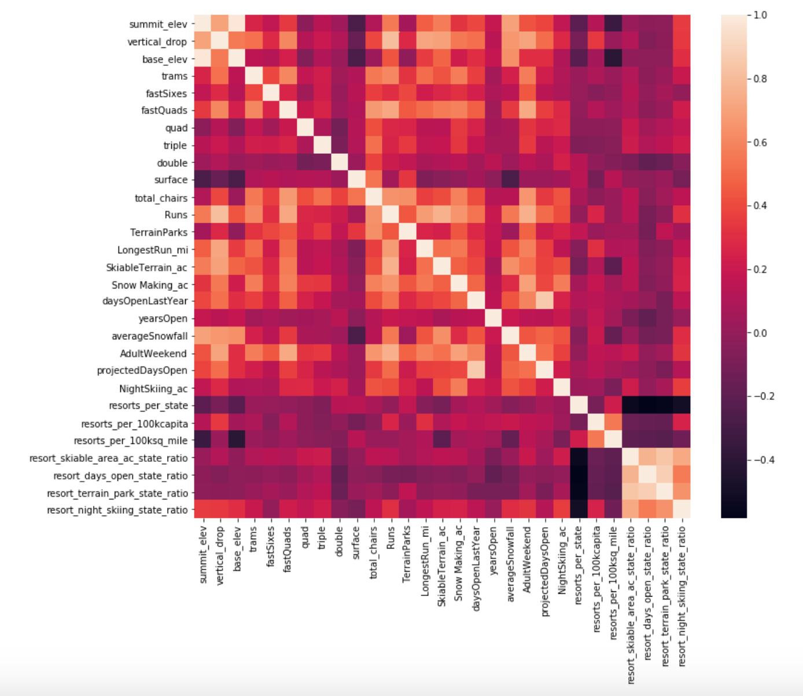
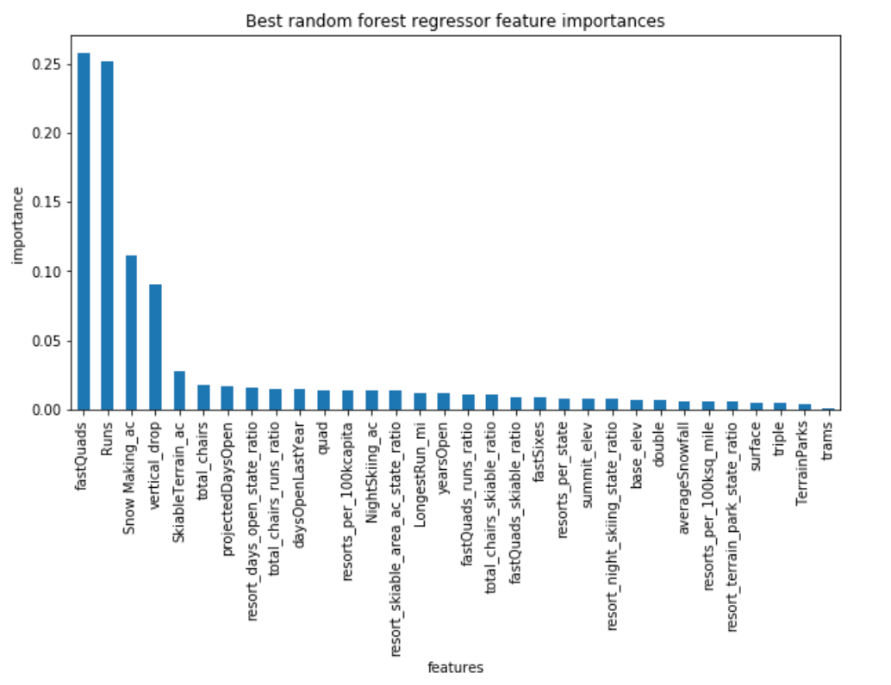
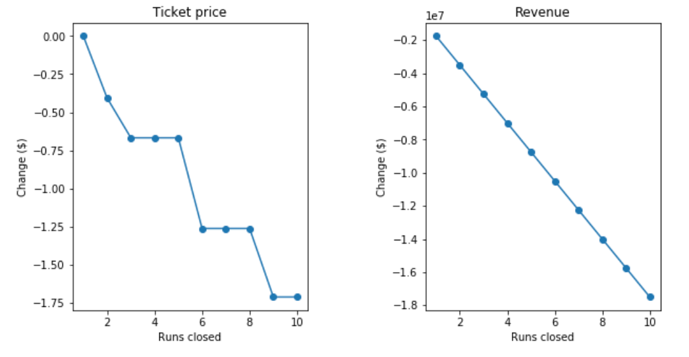

<h1>AvPr - Guided Capstone Project Report</h1>
<h2>Big Mountain Resort Recommendations</h2>
<h3><strong>Problem Statement:</strong></h3>

How a new approach of pricing strategy could improve the financial value of Big Mountain Resort in the next implementation year in the market segment?

<h3>Data:</h3>

The business provided a csv with ski resorts information, this data was selected, wrangled, and prepared to make them ready to apply an Exploratory Data Analysis. Because the ticket price didn't change for Big Mountain Resorts the weekday price was dropped, leaving only the Weekend price as the target of the model prediction; also, the state population and squared area was added to find a quantitative relation between some of the data features:

<ul>
<li>Summit and base elevation are quite highly correlated.</li>
<li>Specific ratio features are&nbsp;negatively correlated with the number of resorts in each state.</li>
<li>The ratio of night skiing area with the number of resorts per capita has a positive correlation (&ldquo;when resorts are more densely located with population, more night skiing is provided.&rdquo;)</li>
<li><strong>AdultWeekend</strong>&nbsp;ticket price is correlated with <strong>vertical_drop, fastQuads, Runs, and&nbsp;Snow Making_ac.</strong>&nbsp;</li>
<li><strong>resort_night_skiing_state_ratio </strong>and night skiing capacity were positive for the price a resort can charge.</li>
</ul>
<h3>Preprocessing and Training</h3>

The model was built using pipelines and trained using <strong>Linear Regression</strong> and <strong>Random Forrest regression</strong> algorithms, where the last has lower cross-validation mean absolute error by almost&nbsp;$1 and less variability.&nbsp;The top&nbsp;four features in the data were:

<ul>
<li>fastQuads</li>
<li>Runs</li>
<li>Snow Making_ac</li>
<li>vertical_drop</li>
</ul>
<h3><strong>Summary</strong></h3>

Big Mountain Resort charges $81us per ticket, and each visitor buys on average 5-day tickets ($ 405 us), and with the numbers of visitors provided (350.000) the annual revenue will be $ 141.350.000 us. The model supports an increase of ~13us - $94 per ticket, increasing the revenue by $23.150.000 per season.

Following; the business scenarios and conclusions:

<ol>

Following the business scenarios and the conclusions:

<ol>
<li>Closing 10 runs could reduce the support for the ticket on $1.75 us each, $3.062.500 us all season.</li>
<li>Incrementing one run, one chair and add 150ft to vertical drop will increase in $1.99 us the ticket - $82.99 us and the revenue on&nbsp;$3.474.638 us.</li>
<li>Adding 2 acres of snow to the last scenario will not show any change to the revenue.</li>
<li>Increasing the longest run by 0.2 miles to boast 3.5 miles length, will require 4 more acres of snowmaking coverage and this will not make a difference in the ticket price/revenue.</li>
</ol>

The new additional chair will add $1,540,000 operating costs this season, supported with the business scenario 2 the revenue will not be affected.

<h3>Limitations</h3>

This model presented some limitations: the ticket price was the only feature with costs evaluated, maybe the selection of the features could be more accurate if the operating costs were provided. Big Mountain resort belongs to the resorts with good/best facilities overall, having a deep knowledge of how the operational costs are related with the facilities certainly will improve the model results and questions that are not solved yet.

